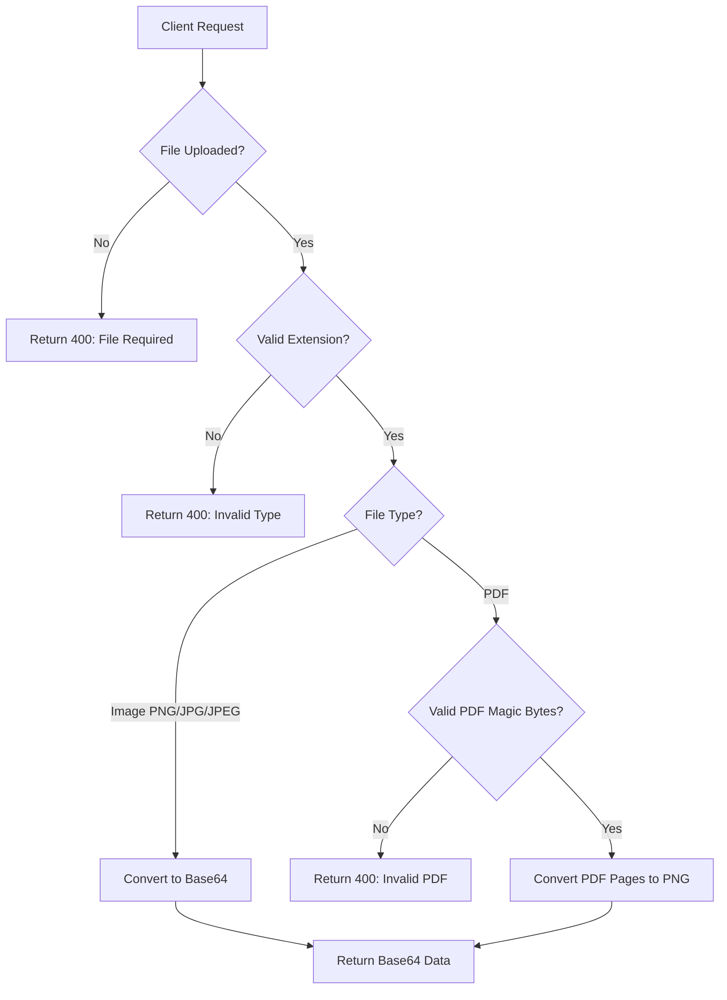

# 📄 Dokumentasi Simple PDF Converter

Dokumentasi lengkap mengenai aplikasi **Simple PDF Converter** - REST API service untuk mengkonversi dokumen PDF menjadi gambar PNG.

---

## 📋 Deskripsi Singkat

Simple PDF Converter adalah layanan REST API ringan dan berkinerja tinggi yang dibangun menggunakan **Go** dan **PDFium WebAssembly runtime**. Aplikasi ini mampu:

- Mengkonversi halaman PDF menjadi gambar PNG berkualitas tinggi
- Mengkonversi gambar (PNG, JPG, JPEG) ke format base64
- Mengembalikan hasil dalam format base64 untuk integrasi yang mudah

---

## 🛠️ Package / Dependencies yang Digunakan

### Dependencies Utama

| Package                           | Versi   | Fungsi                                                             |
| --------------------------------- | ------- | ------------------------------------------------------------------ |
| `github.com/gin-gonic/gin`        | v1.11.0 | Framework HTTP web yang cepat untuk membangun REST API             |
| `github.com/joho/godotenv`        | v1.5.1  | Memuat environment variables dari file `.env`                      |
| `github.com/klippa-app/go-pdfium` | v1.17.2 | Library untuk rendering PDF menggunakan PDFium melalui WebAssembly |

### Dependencies Tidak Langsung (Indirect)

| Package                              | Fungsi                                  |
| ------------------------------------ | --------------------------------------- |
| `github.com/tetratelabs/wazero`      | Runtime WebAssembly untuk Go            |
| `github.com/bytedance/sonic`         | JSON encoder/decoder berkinerja tinggi  |
| `github.com/go-playground/validator` | Validasi struct dan field               |
| `google.golang.org/protobuf`         | Protocol Buffers untuk serialisasi data |

---

## 🏗️ Struktur Project

```
simple-pdf-converter/
├── main.go              # Entry point aplikasi
├── handlers/
│   └── convert.go       # Handler untuk konversi PDF/Image
├── middleware/
│   └── auth.go          # Middleware autentikasi API Key
├── utils/
│   └── pdf.go           # Utilitas PDFium untuk konversi PDF
├── Dockerfile           # Multi-stage Docker build
├── docker-compose.yml   # Konfigurasi Docker Compose
├── .env.example         # Template environment variables
├── go.mod               # Go module definition
├── go.sum               # Dependency checksums
└── README.md            # Dokumentasi dasar
```

---

## ⚙️ Cara Kerja Aplikasi

### 1. Inisialisasi Aplikasi (`main.go`)

```
┌─────────────────────────────────────────────────────────────┐
│                    STARTUP SEQUENCE                         │
├─────────────────────────────────────────────────────────────┤
│ 1. Load environment variables dari .env                     │
│ 2. Inisialisasi PDFium WebAssembly pool                     │
│ 3. Set Gin ke Release Mode                                  │
│ 4. Setup router dengan middleware API Key                   │
│ 5. Register endpoint POST /api/convert                      │
│ 6. Start HTTP server pada port yang dikonfigurasi           │
└─────────────────────────────────────────────────────────────┘
```

### 2. Alur Konversi (`handlers/convert.go`)



### 3. Proses Konversi PDF (`utils/pdf.go`)

1. **Mendapatkan instance** dari PDFium pool (dengan timeout 30 detik)
2. **Membuka dokumen PDF** dari data bytes
3. **Mendapatkan jumlah halaman** dalam PDF
4. **Untuk setiap halaman:**
   - Render halaman ke image dengan DPI 150
   - Encode image ke format PNG
   - Convert PNG ke string base64
5. **Mengembalikan array** string base64 (satu per halaman)

### 4. Autentikasi (`middleware/auth.go`)

```
┌────────────────────────────────────────────┐
│           API KEY VALIDATION               │
├────────────────────────────────────────────┤
│ 1. Ambil header `x-api-key` dari request   │
│ 2. Bandingkan dengan env variable API_KEY  │
│ 3. Jika kosong/tidak valid → 401 Error     │
│ 4. Jika valid → Lanjut ke handler          │
└────────────────────────────────────────────┘
```

---

## 🚀 Cara Penggunaan

### Prasyarat

- Go 1.25 atau lebih tinggi
- Docker (opsional, untuk deployment containerized)

### Setup Environment Variables

```bash
# Copy template environment
cp .env.example .env

# Edit file .env
PORT=8080
API_KEY=your_secret_api_key_here
```

### Menjalankan Secara Lokal

```bash
# Clone repository
git clone https://github.com/fkryakbar/simple-pdf-converter.git
cd simple-pdf-converter

# Jalankan aplikasi
go run .
```

### Menjalankan dengan Docker

**Build manual:**

```bash
docker build -t simple-pdf-converter .
docker run -d -p 8080:8080 \
  -e PORT=8080 \
  -e API_KEY=your_secret_api_key \
  --name pdf-converter \
  simple-pdf-converter
```

**Menggunakan Docker Compose:**

```bash
# Edit .env dengan API_KEY yang diinginkan
docker compose up -d
```

---

## 📡 API Endpoint

### Convert PDF/Image to PNG Base64

**Endpoint:** `POST /api/convert`

**Headers:**

| Header         | Tipe                | Wajib | Deskripsi                 |
| -------------- | ------------------- | ----- | ------------------------- |
| `x-api-key`    | string              | Ya    | API key untuk autentikasi |
| `Content-Type` | multipart/form-data | Ya    | Tipe konten form data     |

**Body (form-data):**

| Field  | Tipe | Wajib | Deskripsi                          |
| ------ | ---- | ----- | ---------------------------------- |
| `file` | file | Ya    | File PDF atau Image (PNG/JPG/JPEG) |

**File yang Didukung:**

- `.pdf` - Dokumen PDF
- `.png` - Gambar PNG
- `.jpg` / `.jpeg` - Gambar JPEG

### Contoh Response Sukses

```json
{
  "message": "success",
  "mimetype": "image/png",
  "extension": "png",
  "data": [
    "iVBORw0KGgoAAAANSUhEUgAA...", // Halaman 1 (base64 PNG)
    "iVBORw0KGgoAAAANSUhEUgAA..." // Halaman 2 (base64 PNG)
  ]
}
```

### Contoh Response Error

```json
{
  "message": "Error description",
  "data": null
}
```

### Contoh Penggunaan

**cURL:**

```bash
curl -X POST http://localhost:8080/api/convert \
  -H "x-api-key: your_api_key" \
  -F "file=@document.pdf"
```

**JavaScript (fetch):**

```javascript
const formData = new FormData();
formData.append("file", pdfFile);

const response = await fetch("http://localhost:8080/api/convert", {
  method: "POST",
  headers: {
    "x-api-key": "your_api_key",
  },
  body: formData,
});

const result = await response.json();
// result.data berisi array string base64 PNG
```

---

## 🐳 Konfigurasi Docker

### Dockerfile

Menggunakan **multi-stage build** untuk ukuran image minimal:

| Stage      | Base Image           | Tujuan                     |
| ---------- | -------------------- | -------------------------- |
| Builder    | `golang:1.25-alpine` | Compile aplikasi Go        |
| Production | `scratch`            | Minimal runtime (~15-25MB) |

### Docker Compose

| Konfigurasi          | Nilai                                           |
| -------------------- | ----------------------------------------------- |
| Image                | `ghcr.io/fkryakbar/simple-pdf-converter:latest` |
| Port                 | 8080 (configurable)                             |
| Memory Limit         | 512MB                                           |
| CPU Limit            | 1.0                                             |
| Healthcheck Interval | 30s                                             |

---

## 📊 Environment Variables

| Variable  | Default        | Deskripsi                         |
| --------- | -------------- | --------------------------------- |
| `PORT`    | `8080`         | Port server HTTP                  |
| `API_KEY` | -              | API key untuk autentikasi (wajib) |
| `TZ`      | `Asia/Jakarta` | Timezone (di Docker)              |

---

## 📄 Lisensi

MIT License
